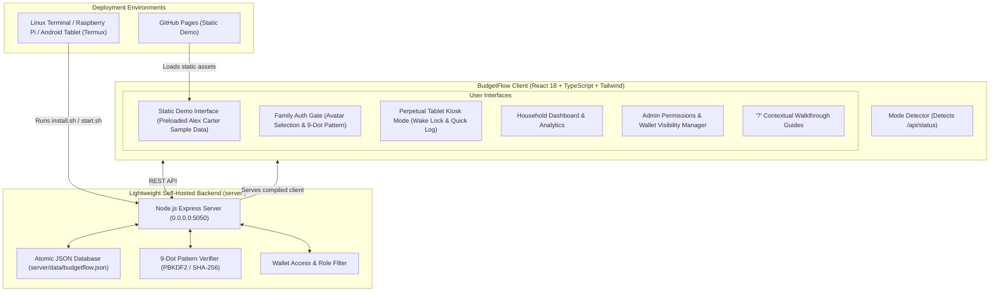

<p align="center">
  <a href="https://jaym3.github.io/budgetflow/">
    
  </a>
</p>

<h1 align="center">BudgetFlow 🌊</h1>

<p align="center">
  <strong>Intelligent, Frictionless Personal & Family Budgeting (Dual-Mode Architecture)</strong>
</p>

<p align="center">
  <a href="https://github.com/JayM3/budgetflow/releases/tag/v1.0.1"></a>
  <a href="https://jaym3.github.io/budgetflow/"></a>
  <a href="https://github.com/JayM3/budgetflow"></a>
  <a href="LICENSE"></a>
  
  
  
</p>

<p align="center">
  <a href="https://jaym3.github.io/budgetflow/"><strong>Explore the Live Demo »</strong></a> •
  <a href="#-dual-distribution-architecture">Dual-Mode Architecture</a> •
  <a href="#-standout-innovations--features">Core Features</a> •
  <a href="#-mathematical-formulas--financial-heuristics">Formulas</a> •
  <a href="#-quick-start--installation">Quick Start</a> •
  <a href="#-perpetual-tablet-kiosk-mode">Tablet Kiosk</a> •
  <a href="#-project-structure">Project Structure</a> •
  <a href="#-license">License</a>
</p>

---

## 🌊 Overview

**BudgetFlow** is a modern, privacy-first personal and family finance application designed to eliminate spreadsheet fatigue and complex subscription budget tools. Built around real household dynamics, BudgetFlow combines daily spending velocity pacing, pre-shopping scenario simulation, dynamic envelope rebalancing, and an always-on tablet kiosk interface into a fast, intuitive experience.

Unlike conventional budgeting applications that lock your financial data behind third-party cloud subscriptions, BudgetFlow is engineered with a **dual-distribution model**:

1. **GitHub Pages Demo Mode**: 100% static, client-side only web application pre-loaded with realistic sample data for instant zero-friction exploration right in your browser.
2. **BudgetFlow Family Hub (Self-Hosted Private Server)**: A local-first, lightweight finance server designed to run 24/7 on Linux home servers, Raspberry Pi, mini PCs, or an Android tablet running **Termux**. It starts with a **true clean slate (0 balance, 0 transactions)**, local Wi-Fi auto-discovery, 9-dot pattern touch authentication, and granular multi-user wallet permissions.

BudgetFlow requires **zero native C++ build tools**, guaranteeing failure-free installation on minimal Linux and ARM64 Android Termux environments.

---

## 🛠️ Standout Innovations & Features

### 1. 🎯 Daily "Safe-to-Spend" Velocity Meter
Traditional budgeting apps tell you that you have "$1,200 left for the month", leaving you to guess how much you can spend today without running out of money before payday.
- **Dynamic Daily Pacing**: Calculates your exact safe daily spending allowance ($S_{\text{daily}}$) based on your remaining disposable balance and the days remaining in the month.
- **Real-Time Pace Status**: Color-coded indicators flag your velocity:
  - 🟢 **Optimal Pace**: Current daily burn rate is comfortably within limits.
  - 🟡 **Cool Down Needed**: Daily burn exceeds the target budget rate by more than 15%.
  - 🔴 **Budget Exceeded**: Allocated budget has been reached; recommends rebalancing.

---

### 2. 🔮 "What-If" Purchase Simulator
Evaluate discretionary purchases *before* you tap your card or click checkout.
- **Instant Impact Analysis**: Enter a prospective cost (e.g. 2 500 kr for a weekend trip or 450 kr for a dinner out).
- **Allowance Compression**: Calculates exactly how much your daily safe-to-spend allowance drops for the rest of the month ($\Delta S_{\text{daily}}$).
- **Savings Milestone Projection**: Estimates how many days the purchase pushes back your long-term savings goals.
- **Automated Verdict**: Provides plain-English recommendations (*Safe*, *Caution*, or *Critical*).

---

### 3. ⚖️ Dynamic Envelope Smoothing (No-Guilt Budgeting)
Life doesn't always adhere to rigid monthly categories.
- **1-Click Surplus Transfers**: Overspent on Groceries? Instantly rebalance surplus funds from another category (e.g. Dining & Entertainment or Transport) with a single tap.
- **Budget Invariant Preservation**: Keeps your total monthly budget ceiling intact while giving you the flexibility to adapt to unexpected expenses.

---

### 4. 🔒 9-Dot Pattern Touch Authentication
Typing complex alphanumeric passwords on a shared kitchen tablet is slow and cumbersome.
- **Tactile 3x3 Dot Grid**: Touch- and mouse-friendly Android lockscreen-style pattern interface with smooth line tracing and haptic feedback.
- **Cryptographic Security**: Hashed using Node.js native `crypto.pbkdf2Sync` (PBKDF2 / SHA-256 with 1,000 iterations) using unique per-user 16-byte random salts.
- **Constant-Time Verification**: Prevents timing attacks with `crypto.timingSafeEqual`.
- **Frictionless Family Logging**: Family members simply tap their avatar, swipe their 4+ dot pattern, and log their expense.

---

### 5. 📱 Perpetual Tablet Kiosk Mode
Turn an old Android tablet, iPad, or touch display into a dedicated family finance kiosk mounted on your fridge or kitchen counter.
- **Ambient Glance Screen**: High-contrast ambient display featuring a digital clock, live Safe-to-Spend pacing gauge, monthly progress ring, and upcoming bills countdown.
- **Screen Wake Lock API**: Uses `navigator.wakeLock` to keep the tablet screen perpetually awake without dimming.
- **Fullscreen & Jumbo Room View**: Toggle between standard desktop view, native fullscreen, and high-visibility Jumbo Room View readable from across the room.
- **2-Step Button-Driven Logger**: Big touch-friendly increment buttons (`+/- 1, 5, 25, 100, 500` for NOK; `+/- 0.25, 1, 5, 25, 100` for USD/EUR) and visual category tiles. No tiny dropdowns or software keyboards required.
- **15-Second Auto-Lock Reset**: Returns automatically to the ambient clock screen after logging an expense.

---

### 6. 👨‍👩‍👧‍👦 Granular Family Wallet Permissions & Roles
A shared family budget that respects individual privacy.
- **Admin vs. Member Roles**: Admin manages household settings, creates accounts, and assigns permissions.
- **Per-Wallet Visibility**: Admins configure which accounts each member can view or spend from (e.g. teens only see their Cash and Allowance wallets; mortgage, investment, and credit accounts stay hidden).
- **Multi-Device Auth Gate**: Unauthenticated household devices are greeted with a secure Log In / Join Family gate.
- **User Attribution**: Every logged expense and income transaction records the responsible family member (`userId` and `userName`).

---

### 7. 💡 Interactive "?" Contextual Walkthrough Guides
- Unobtrusive `(?)` guide buttons located on every major card (Safe-to-Spend, Envelope Rebalancer, What-If Simulator, Tablet Kiosk, Pattern Security).
- Clean interactive modals provide concise financial explanations, step-by-step instructions, and practical pro tips.

---

### 8. 🌐 Multi-Currency & Scandinavian Formatting
- **Norwegian Krone Default (NOK / kr)**: Styled with standard Scandinavian formatting (`1 250 kr`).
- **USD ($) & EUR (€) Support**: Seamlessly toggle between NOK, USD, and EUR.
- **Smart Omnibar Parser**: Deterministic NLP regex parser recognizes natural inputs like `"500 kr groceries at Kiwi"`, `"Dinner $45"`, or `"€30 fuel"`.
- **CSV Data Import**: Import bank statements with auto-categorization and column mapping.

---

## 🏛️ Dual-Distribution Architecture



### Feature Comparison Matrix

| Feature | GitHub Pages Demo Mode | Self-Hosted Family Hub |
| :--- | :---: | :---: |
| **Hosting Model** | 100% Static (GitHub Pages, Vercel, Netlify) | Local-First Node.js Server (`0.0.0.0:5050`) |
| **Initial State** | Pre-populated sample data (Alex Carter) | **Clean Slate from 0** (guided setup wizard) |
| **Backend / DB** | None (Browser `localStorage`) | Atomic JSON transaction engine (`server/data/`) |
| **Dependencies** | Zero backend dependencies | **Zero native C++ build tools** (`express`, `cors`) |
| **Multi-User Auth** | Single-user interactive preview | 9-Dot Pattern Auth (PBKDF2 / SHA-256) |
| **Wallet Permissions**| Preview mode | Granular Admin/Member visibility matrix |
| **Tablet Kiosk Mode** | Full UI preview | Fullscreen, Wake Lock, Auto-Lock, Multi-Device |
| **Target Hardware** | Any modern web browser | Linux, Raspberry Pi, Mini PC, Android Termux |

---

## 📐 Mathematical Formulas & Financial Heuristics

### 1. Daily Safe-to-Spend Allowance
Computes the daily spending limit required to complete the month without running a deficit:

$$S_{\text{daily}} = \frac{\max\left(0, B_{\text{total}} - E_{\text{spent}}\right)}{D_{\text{remaining}}}$$

Where:
- $B_{\text{total}}$: Total monthly allocated budget
- $E_{\text{spent}}$: Cumulative monthly expenses to date
- $D_{\text{remaining}}$: Remaining days in the current billing cycle ($\max(1, D_{\text{month}} - D_{\text{today}})$)
- $S_{\text{daily}}$: Safe spending allowance per remaining day

---

### 2. Spending Velocity & Pacing Status
Evaluates whether current daily spending behavior is sustainable:

$$\bar{E}_{\text{daily}} = \frac{E_{\text{spent}}}{D_{\text{today}}}, \qquad \bar{B}_{\text{target}} = \frac{B_{\text{total}}}{D_{\text{month}}}$$

- **Optimal Pace** (🟢): $\bar{E}_{\text{daily}} \le 1.15 \times \bar{B}_{\text{target}}$
- **Cool Down Needed** (🟡): $\bar{E}_{\text{daily}} > 1.15 \times \bar{B}_{\text{target}}$
- **Budget Exceeded** (🔴): $E_{\text{spent}} \ge B_{\text{total}}$

---

### 3. "What-If" Purchase Impact & Savings Goal Delay
Measures the reduction in daily spending flexibility and the projected delay on savings goals:

$$\Delta S_{\text{daily}} = S_{\text{daily}}^{\text{old}} - \frac{\max\left(0, B_{\text{remaining}} - C_{\text{purchase}}\right)}{D_{\text{remaining}}}$$

$$\text{Delay}_{\text{Goal}} = \left\lceil \frac{C_{\text{purchase}}}{\frac{B_{\text{total}} \times 0.15}{30}} \right\rceil \text{ days}$$

Where $C_{\text{purchase}}$ is the prospective cost, assuming an average monthly savings allocation of 15% of the total budget.

---

### 4. Dynamic Envelope Conservation Invariant
Surplus transfers between budget envelopes preserve the total household budget ceiling:

$$B_{\text{category}_a} \leftarrow B_{\text{category}_a} + \Delta, \qquad B_{\text{category}_b} \leftarrow B_{\text{category}_b} - \Delta$$

$$\sum_{i=1}^{n} B_{\text{category}_i} = B_{\text{total}} \quad (\text{Invariant conserved})$$

---

## ⚡ Quick Start & Installation

### Option 1: Live Web Demo (Instant)
Experience BudgetFlow immediately in your browser with zero installation:
👉 **[https://jaym3.github.io/budgetflow/](https://jaym3.github.io/budgetflow/)**

---

### Option 2: Self-Hosted Hub on Linux & Android Termux (Recommended)

BudgetFlow includes an automated installation script that checks prerequisites, builds the production frontend bundle, and prepares the lightweight backend.

#### 1. Clone the Repository
```bash
git clone https://github.com/JayM3/budgetflow.git
cd budgetflow
```

#### 2. Run Automated Installer
```bash
chmod +x install.sh start.sh
./install.sh
```

> [!NOTE]
> On Android Termux, `install.sh` automatically uses `pkg` to install `nodejs` and `git` without requiring root permissions.

#### 3. Control & Manage with the `budgetflow` CLI

BudgetFlow provides a unified cross-platform CLI tool:

```bash
# Start the server daemon (runs in background by default)
budgetflow

# Or explicitly:
budgetflow start

# Check live server status, PID, and local network Wi-Fi URL
budgetflow status

# View or stream live background logs
budgetflow logs -f

# Stop the running server
budgetflow stop

# Restart the server
budgetflow restart

# Run environment & network diagnostics
budgetflow doctor

# Create an immediate database backup snapshot
budgetflow backup

# Factory reset: wipes all data back to clean slate (with automated safety backup)
budgetflow wipe

# Self-update BudgetFlow to latest release (or latest repo commits)
budgetflow update

# Open BudgetFlow in your default browser
budgetflow open
```

##### Command Reference Table

| Command | Options | Description |
| :--- | :--- | :--- |
| `budgetflow` / `budgetflow start` | `-p, --port <port>`<br>`-f, --foreground`<br>`-o, --open` | Starts the server in background daemon mode (default) or attached in terminal (`-f`). |
| `budgetflow stop` | `--force` | Stops the running background process. |
| `budgetflow restart` | `-p, --port <port>` | Stops and immediately restarts the hub server. |
| `budgetflow status` | `--json` | Displays active status, PID, port, LAN IPv4 address, and setup state. |
| `budgetflow logs` | `-f, --follow`<br>`-n, --lines <n>` | Tails or streams live output logs from `server/data/budgetflow.log`. |
| `budgetflow wipe` | `-y, --yes`<br>`--no-backup`<br>`--reinstall` | **Factory Reset**: Wipes all data, users, and transactions. Automatically saves a safety snapshot before resetting unless `--no-backup` is specified. |
| `budgetflow backup` | `[output-dir]` | Creates timestamped snapshot in `server/data/backups/`. |
| `budgetflow restore` | `<backup-file> -y` | Overwrites current database with specified backup snapshot. |
| `budgetflow export` | `[json\|csv] -o <file>` | Exports data to full JSON or CSV transaction statement. |
| `budgetflow doctor` | *(none)* | Comprehensive health check (Node, npm, permissions, port, IP, GitHub update service). |
| `budgetflow update` | `--check`<br>`--force`<br>`--repo, --source`<br>`--channel <branch>`<br>`--no-restart`<br>`--no-backup` | **Autonomous Self-Update**: Queries GitHub for official releases or smoothly falls back to the latest repository commits. Preserves local user data (`server/data/`), creates pre-update snapshot, updates dependencies, rebuilds `/dist`, and restarts the server daemon. |
| `budgetflow service` | `install \| uninstall` | Installs system autostart (Linux systemd user unit or Termux:Boot script). |

#### 4. Initial Setup Wizard
On first visit to `http://<server-ip>:5050`, the guided setup modal prompts you to:
1. Name your Household.
2. Select default currency (`NOK`, `USD`, or `EUR`).
3. Create your Admin user profile and draw your master 9-dot pattern.
4. Set up starting household wallets (e.g. Checking Account, Savings, Cash).

---

### Option 3: Local Development Server

If you are developing or customizing BudgetFlow:

```bash
# Install frontend dependencies
npm install

# Run Vite development server
npm run dev

# In a separate terminal, start backend server (optional)
cd server
npm install
node server.js
```

---

## 📱 Perpetual Tablet Kiosk Setup

Setting up an always-on kitchen or hallway tablet:

1. **Mount Tablet**: Mount any Android tablet, iPad, or touchscreen display on a kitchen wall, counter stand, or refrigerator.
2. **Open Browser**: Point Chrome, Firefox, or [Fully Kiosk Browser](https://www.fully-kiosk.com/) to `http://<server-ip>:5050`.
3. **Activate Tablet Mode**: Click the **Tablet Kiosk** icon in the top header.
4. **Enable Wake Lock & Fullscreen**: Tap **Full Screen** and toggle **Keep Screen Awake**.
5. **Jumbo Room View**: If viewing the tablet from across the room, tap the **Zoom / Room View** toggle for high-visibility metrics.
6. **Logging Expenses**:
   - Family member walks up and taps `+ Log Expense`.
   - Uses `+ / -` touch increment buttons to enter amount.
   - Selects Category and Account.
   - Draws their 9-dot pattern $\rightarrow$ expense is recorded with user attribution $\rightarrow$ returns to ambient clock display after 15 seconds.

---

## 🎨 Application Icons & Assets

High-resolution application assets located in [`public/`](public/) and [`Icon/`](Icon/):

| Asset | Preview | Dimensions | Usage |
| :---: | :---: | :---: | :--- |
| **Favicon** |  | 32 × 32 | Browser tab favicon |
| **Logo** |  | 512 × 512 | Header branding, modal showcase & PWA icon |
| **Touch Icon** |  | 512 × 512 | Apple touch icon & Android homescreen shortcut |

---

## 📂 Project Structure

```
budgetflow/
├── bin/                                  # Global CLI Executables
│   ├── budgetflow.js                     # Unified cross-platform Node CLI entrypoint
│   └── budgetflow.cmd                    # Windows Command Prompt launcher
├── install.sh                            # One-click installer with automatic global CLI linking
├── start.sh                              # Hub server quick launcher
├── package.json                          # Frontend dependencies, bin entry & build scripts
├── package-lock.json                     # Dependency lockfile
├── server/                               # Lightweight Self-Hosted Family Hub Backend
│   ├── auth.js                           # 9-dot pattern hasher (PBKDF2/SHA-256) & sessions
│   ├── db.js                             # Atomic JSON transactional storage (power-loss safe)
│   ├── package.json                      # Backend dependencies (express, cors - zero C++ modules)
│   ├── server.js                         # Express HTTP/REST API server (0.0.0.0:5050)
│   ├── cli/                              # CLI Command Implementations
│   │   ├── processManager.js             # Daemon spawn, PID tracking, stop/kill, log streaming
│   │   ├── dataManager.js                # Factory wipe, automated backup, restore & export
│   │   ├── doctor.js                     # Health & environment diagnostics
│   │   ├── serviceManager.js             # Linux systemd & Termux:Boot autostart config
│   │   └── ui.js                         # Box drawing banners, colors & prompts
│   └── data/                             # Local household database storage & backups
│       ├── budgetflow.json               # Live household database
│       └── backups/                      # Automated pre-wipe & manual snapshots
├── dist/                                 # Production compiled frontend bundle
├── public/                               # Static web assets
├── src/                                  # Frontend Application Source Code (React 18 + TS)
    ├── App.tsx                           # Root application layout & routing
    ├── main.tsx                          # React DOM entry point
    ├── index.css                         # Global CSS & Tailwind layers
    ├── vite-env.d.ts                     # Vite TypeScript declarations
    ├── assets/                           # Bundled component assets
    │   └── logo.png                      # Application logo
    ├── components/
    │   ├── auth/
    │   │   ├── InitialSetupModal.tsx     # Clean slate onboarding wizard
    │   │   ├── PatternLock.tsx           # Interactive 3x3 9-dot canvas pattern component
    │   │   └── UserSelectModal.tsx       # Multi-user lockscreen & member registration gate
    │   ├── dashboard/                    # Overview dashboard widgets
    │   │   ├── BudgetDonutCard.tsx       # Progress donut ring with category breakdown
    │   │   ├── CategorySpendingCard.tsx  # Dynamic vertical category progress bars
    │   │   ├── IncomeVsExpensesCard.tsx  # Income vs spending balance bar
    │   │   ├── RecentTransactionsCard.tsx# Interactive transaction feed with filters
    │   │   ├── SavingsGoalBanner.tsx     # Featured savings goal pot
    │   │   └── StatCardsGrid.tsx         # 4 primary financial metrics cards
    │   ├── features/                     # Core interactive tools
    │   │   ├── CsvImportModal.tsx        # CSV statement importer with column mapper
    │   │   ├── QuickAddModal.tsx         # Friendlier 2-step button-driven expense logger
    │   │   ├── SafeToSpendPacer.tsx      # Safe-to-Spend pacing gauge & trajectory
    │   │   └── WhatIfSimulatorModal.tsx  # Purchase impact & goal delay simulator
    │   ├── guide/                        # Educational components
    │   │   ├── GuideButton.tsx           # Contextual (?) help trigger
    │   │   └── GuideModal.tsx            # Step-by-step interactive feature explainers
    │   ├── layout/                       # App frame
    │   │   ├── Header.tsx                # Top navigation, user switcher & mode indicator
    │   │   └── Sidebar.tsx               # Primary views navigation sidebar
    │   ├── tablet/                       # Kiosk interface
    │   │   └── TabletKioskView.tsx       # Always-on ambient kiosk with wake lock & room view
    │   └── views/                        # Full view pages
    │       ├── BillsView.tsx             # Upcoming recurring bills manager
    │       ├── BudgetsView.tsx           # Envelope budgets & rebalancing tool
    │       ├── DashboardView.tsx         # Primary overview screen
    │       ├── FamilyMembersView.tsx     # Admin wallet permissions & member manager
    │       ├── GoalsView.tsx             # Savings goals & contribution tracker
    │       ├── ReportsView.tsx           # Spending trends & category charts
    │       ├── SettingsView.tsx          # Household preferences & currency settings
    │       ├── TransactionsView.tsx      # Full transaction ledger with search & filters
    │       └── WalletsView.tsx           # Bank, cash, and credit accounts management
    ├── context/
    │   └── FinanceContext.tsx            # Global state manager supporting dual-mode sync
    ├── data/
    │   ├── guidesData.ts                 # Contextual guide walkthrough contents & pro tips
    │   └── initialData.ts                # Clean slate initial state & demo mode dataset
    ├── services/
    │   └── api.ts                        # Backend REST API client with graceful offline fallback
    ├── types/
    │   └── finance.ts                    # TypeScript types (FamilyUser, Wallet, Role, Permissions)
    └── utils/
        ├── env.ts                        # Runtime environment detector (GitHub Pages vs Local Hub)
        ├── formatters.ts                 # Currency-aware formatting (NOK kr, USD $, EUR €)
        ├── insightsEngine.ts             # Safe-to-Spend & What-If simulation math
        ├── localParser.ts                # Deterministic regex NLP omnibar parser
        ├── merchantRules.ts              # Smart merchant auto-categorization rules
        └── patternAuth.ts                # Client-side 9-dot pattern hashing & comparison
```

---

## 🔒 Privacy, Security & Resilience

- **100% Local-First**: Your financial information never leaves your local network. No external APIs, no tracking cookies, and zero cloud telemetry.
- **Atomic File Transactions**: Database writes in `server/db.js` use temporary file staging (`.tmp` write followed by atomic `renameSync`), preventing file corruption during sudden power losses on battery-operated tablets or Raspberry Pis.
- **Salted Cryptographic Auth**: 9-dot patterns are salted with 16 cryptographically secure random bytes and hashed with PBKDF2 (SHA-256) using constant-time comparison to protect against brute-force and timing attacks.
- **Local Network Isolation**: The backend server binds strictly to your local network interface (`0.0.0.0:5050`), keeping household data completely invisible to the public internet.

---

## 🤝 Contributing

Contributions, feature suggestions, and pull requests are welcome!

1. Fork the project repository.
2. Create your feature branch (`git checkout -b feat/AmazingFeature`).
3. Commit your changes (`git commit -m 'feat: Add AmazingFeature'`).
4. Push to the branch (`git push origin feat/AmazingFeature`).
5. Open a Pull Request.

---

## 📄 License

Distributed under the **MIT License**. See [`LICENSE`](LICENSE) for more information.

---

<p align="center">
  Built with ❤️ for privacy-minded households.
  <br />
  <a href="https://jaym3.github.io/budgetflow/"><strong>Launch Live Demo</strong></a> •
  <a href="https://github.com/JayM3/budgetflow/issues"><strong>Report an Issue</strong></a>
</p>
